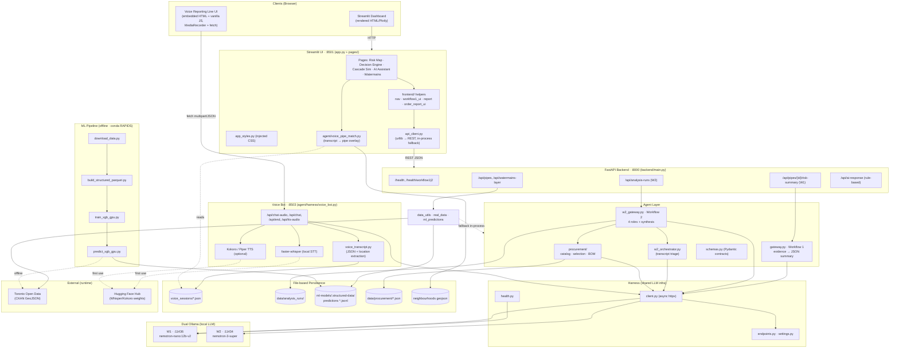
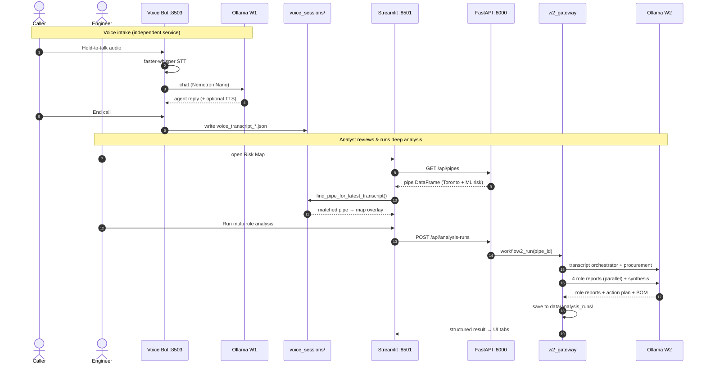

# SubSurface / CityNerve — System Architecture

**SubSurface** (branded **CityNerve**) is a predictive infrastructure-intelligence platform for
Toronto's watermain network, built for the NVIDIA Spark Hackathon. It combines a GPU ML pipeline
(RAPIDS / XGBoost / SHAP), geospatial data fusion from Toronto Open Data, dual local LLM workflows
(Nemotron via Ollama), a Streamlit dashboard, and an optional push-to-talk voice reporting line.

## Service topology

| Service | Port | Entry point | Role |
|---------|------|-------------|------|
| Streamlit UI | 8501 | `app.py` + `pages/` | Dashboard: risk map, decision engine, cascade sim, AI assistant |
| FastAPI backend | 8000 | `backend/main.py` | Data + AI workflow API (Streamlit talks here, never to Ollama directly) |
| Voice Reporting Line | 8503 | `agent/harness/voice_bot.py` | Push-to-talk caller intake (Whisper STT + Ollama + optional TTS) |
| Ollama W1 | 11436 | `nemotron-nano:12b-v2` | Fast JSON risk summaries, voice agent, neighbourhood match |
| Ollama W2 | 11434 | `nemotron-3-super:latest` | Multi-role deep analysis, synthesis, procurement |

One-command startup: `./scripts/run_citynerve.sh`. Offline ML pipeline: `ml-models/run_pipeline.sh`
(separate conda `rapids-26.04` env).

## System architecture

Mermaid source

## Request flows

Mermaid source

## Key characteristics

- **Three runtime services** (Streamlit, FastAPI, Voice Bot). Streamlit never calls Ollama
  directly — it routes through FastAPI, with an in-process fallback if the API is unreachable.
- **Two LLM workflows on dual Ollama**: W1 (Nemotron Nano) for fast JSON summaries and the voice
  agent; W2 (Nemotron Super) for 4-role + synthesis analysis, transcript orchestration, and procurement.
- **The harness** (`agent/harness/`) is the shared async LLM infrastructure every caller routes through.
- **Voice → analysis handoff**: the voice bot writes transcript JSON; `voice_pipe_match` geocodes
  and street-matches it to a pipe, overlays a caller report on the map, and optionally feeds Workflow 2.
- **Local-first / no cloud**: all inference is local Ollama; persistence is entirely files. The only
  external runtime calls are Toronto Open Data (CKAN) and Hugging Face (first-time model weights).
- **Offline ML pipeline** (conda RAPIDS env) trains XGBoost on GPU and emits prediction JSONL the
  app joins onto live pipe data at runtime.
