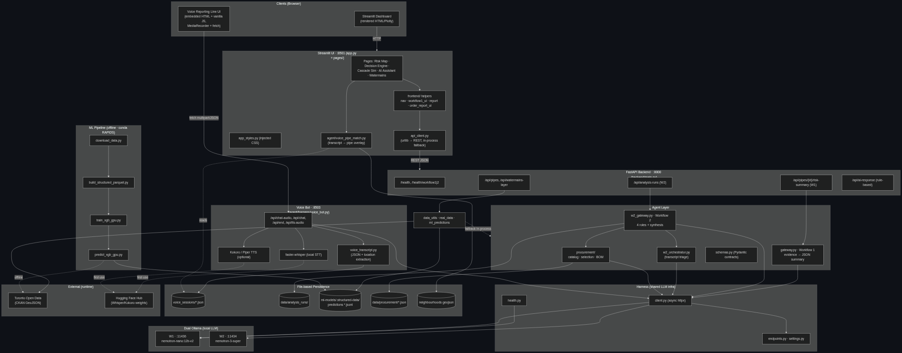
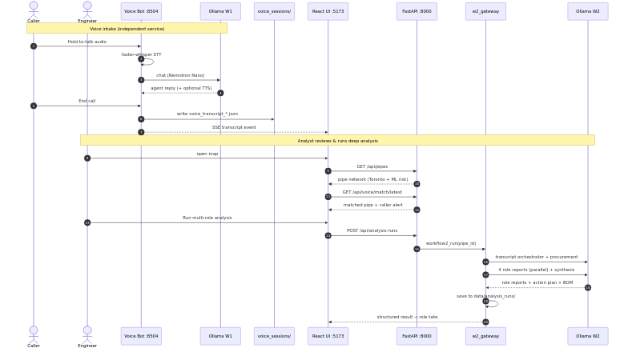

# SubSurface — CityNerve

Predictive infrastructure intelligence for Toronto's watermain network — GPU ML (RAPIDS / XGBoost / SHAP), dual Nemotron agents, and a Mapbox operations UI. Built for the NVIDIA Spark Hackathon — Toronto.

---

## Quick start

### 1. Prerequisites

| Tool | Notes |
|------|--------|
| Python 3.10+ | 3.12 on GX10 |
| Node.js 18+ | React UI |
| [Ollama](https://ollama.com) | Two instances (W1 + W2) |
| [Mapbox token](https://account.mapbox.com/access-tokens/) | Required for the 3D map |
| NVIDIA GPU | Optional — faster Whisper; CPU OK |

```bash
OLLAMA_HOST=127.0.0.1:11434 ollama pull nemotron-3-super:latest   # W2
OLLAMA_HOST=127.0.0.1:11436 ollama pull nemotron-nano:12b-v2    # W1 + voice
```

GX10 dual-Ollama: [GX10-Nemotron-Ollama-Cheatsheet.md](GX10-Nemotron-Ollama-Cheatsheet.md)

### 2. Setup (once)

```bash
python3 -m venv .venv && source .venv/bin/activate
pip install -r requirements.txt
cp .env.example .env
cp SubSurface-UI/.env.example SubSurface-UI/.env
cd SubSurface-UI && npm install && cd ..
```

Edit env files per [Environment & keys](#environment--keys) below (only **Mapbox** is a real external secret).

### 3. Run

```bash
source .venv/bin/activate
./scripts/run_citynerve.sh          # stop: ./scripts/run_citynerve.sh --stop
```

| URL | Service |
|-----|---------|
| http://127.0.0.1:5173 | React UI — map, W1/W2 |
| http://127.0.0.1:8000/docs | FastAPI |
| http://127.0.0.1:8504/client/ | Voice Reporting Line |

Custom ports: `FASTAPI_PORT=9000 UI_PORT=5174 VOICE_CHAT_PORT=8505 ./scripts/run_citynerve.sh` — then align [`.env` samples](#environment--keys).

**Manual / API-only:** [agent/README.md](agent/README.md) · `uvicorn backend.main:app --host 127.0.0.1 --port 8000`

### 4. Verify

```bash
./agent/scripts/check_endpoints.sh
curl -s http://127.0.0.1:8000/health | python3 -m json.tool
```

In the UI: open the map → select a pipe → **Workflow 1** summary appears. Use **real data** (default) for the full demo; `use_real=false` is synthetic smoke-test only.

**Voice demo:** hold mic at `/client/` → speak → release → **End call** → run **Workflow 2** on the matched pipe.

---

## Architecture

**Stack:** Open Data Toronto · RAPIDS (cuDF, cuSpatial, cuML) · XGBoost · SHAP · cuGraph · FastAPI · Nemotron (Ollama) · React · Mapbox GL · faster-whisper

The UI and voice client call **FastAPI only** (`:8000`) — never Ollama directly.

### System topology



### Request flows



| Service | Port |
|---------|------|
| SubSurface-UI | 5173 |
| FastAPI | 8000 |
| Voice line | 8504 |
| Ollama W1 / W2 | 11436 / 11434 |

Details: [ARCHITECTURE.md](ARCHITECTURE.md)

```text
SubSurface/
├── SubSurface-UI/   # Map, W1/W2, voice alerts
├── backend/         # FastAPI
├── agent/           # Harness, gateways, voice bot
├── ml-models/       # Offline GPU training (optional)
├── data/            # Watermains, ML join, procurement
└── scripts/         # run_citynerve.sh
```

---

## Data & provenance

| Data | Source | Location |
|------|--------|----------|
| Watermain geometry | [Open Data Toronto](https://open.toronto.ca/) CKAN `watermains` | `data/watermains/` or `real_data.py` |
| Training set (breaks, trees) | Same portal | `ml-models/download_data.py` |
| Risk + SHAP | XGBoost pipeline | `ml_enriched_pipes.parquet`, `ml-models/.structured-data/` |
| Procurement BoM | City contracts CSV → synthetic catalog | `data/procurement/` |
| Synthetic pipes | Local generator (seed 42) | `use_real=false` only |

Default: **`use_real=true`** (Toronto + ML-enriched risk).

---

## Environment & keys

No cloud LLM API. Inference is **local Ollama**; the OpenAI-compatible client still expects a dummy key.

| Secret / key | Required? | Where | Notes |
|--------------|-------------|-------|--------|
| **Mapbox** `VITE_MAPBOX_TOKEN` | **Yes** (UI map) | `SubSurface-UI/.env` | Free at [mapbox.com](https://account.mapbox.com/access-tokens/) |
| `OPENAI_API_KEY` | Yes (placeholder) | repo `.env` | Use `ollama` — not a real OpenAI key |
| Ollama models | Yes | pulled in step 1 | ~tens of GB disk; 32 GB+ RAM recommended for W2 |
| Toronto / ML data | No (bundled) | `data/watermains/` | Demo runs offline; no CKAN fetch required |

If you change ports in `run_citynerve.sh`, set matching values in both `.env` files (see samples).

### Sample `.env` (repo root)

Copy from [`.env.example`](.env.example). Minimal working local demo:

```bash
WORKFLOW1_OPENAI_BASE_URL=http://127.0.0.1:11436/v1
WORKFLOW1_MODEL=nemotron-nano:12b-v2
WORKFLOW2_OPENAI_BASE_URL=http://127.0.0.1:11434/v1
WORKFLOW2_MODEL=nemotron-3-super:latest
WORKFLOW2_CHAT_TIMEOUT_SECONDS=1800
W2_PARALLEL=false
OPENAI_API_KEY=ollama
```

Custom Ollama ports (example): `WORKFLOW1_OPENAI_BASE_URL=http://127.0.0.1:11437/v1` and start with `OLLAMA_W1_PORT=11437 ./scripts/run_citynerve.sh`.

### Sample `SubSurface-UI/.env`

Copy from [`SubSurface-UI/.env.example`](SubSurface-UI/.env.example):

```bash
VITE_MAPBOX_TOKEN=pk.your_mapbox_token_here
VITE_API_PROXY_TARGET=http://127.0.0.1:8000
VITE_VOICE_CHAT_PORT=8504
```

If FastAPI is not on `8000`: `VITE_API_PROXY_TARGET=http://127.0.0.1:9000` (match `FASTAPI_PORT`).

### Voice (optional)

Defaults work with `run_citynerve.sh`. For Whisper/TTS tuning, copy [`agent/.env.example`](agent/.env.example) → `agent/.env` or export before run:

```bash
VOICE_WHISPER_DEVICE=cpu    # use if GPU memory is tight
VOICE_TTS_ENGINE=none       # kokoro | piper | none
```

---

## Limitations & next steps

**Limitations:** dual Ollama + large models; W2 is slow (5+ Super calls); ~3k distribution pipes on map; partial stressor fusion; voice match needs real streets; cuGraph cascade ≠ hydraulic (EPANET).

**Next steps:** fuse remaining Open Data layers; cascade + reasoning trace in UI; production hardening and GPU vs CPU benchmarks.

---

## Troubleshooting

| Issue | Fix |
|-------|-----|
| `ollama` / `npm` missing | Install tools or run API-only (`uvicorn backend.main:app`) |
| Port in use | `./scripts/run_citynerve.sh --stop` or custom `*_PORT` env vars |
| Blank map | Set `VITE_MAPBOX_TOKEN`, restart Vite |
| LLM errors | `./agent/scripts/check_endpoints.sh`; confirm models pulled |
| W2 slow | Expected — allow several minutes |
| Whisper CUDA (GX10) | [agent/README.md](agent/README.md#gx10-faster-whisper-cuda-setup) |

```bash
pytest agent/tests/ -v
```

**Docs:** [agent/README.md](agent/README.md) · [SubSurface_Specification.md](SubSurface_Specification.md)
